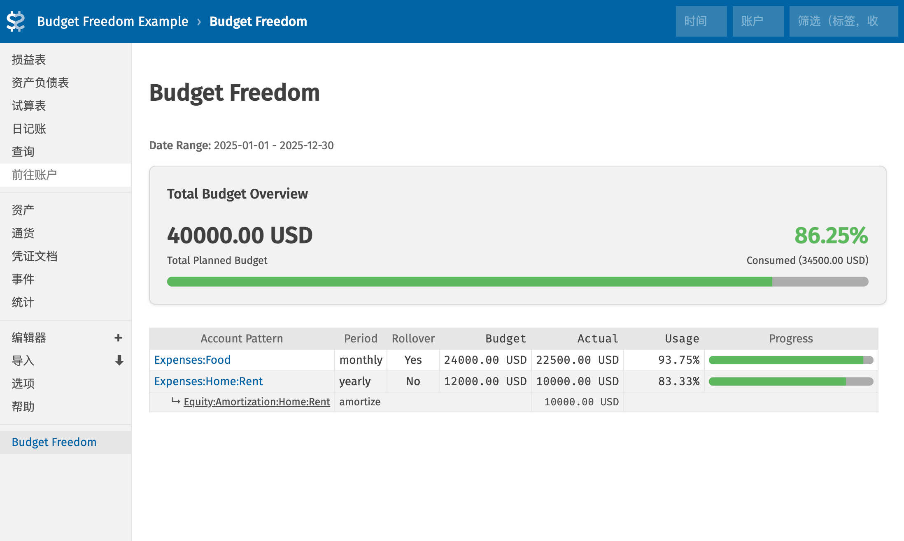

# Fava Budget Freedom

English | [简体中文](README_zh-CN.md)

Fava Budget Freedom is a [Fava](https://beancount.github.io/fava/) extension plugin designed to provide flexible and powerful budget management and visualization features. It supports wildcard-based account matching, multiple budget periods, and budget rollover mechanism to help you achieve better financial freedom.

## Key Features

- **Flexible Budget Definitions**: Define budgets using custom directives with wildcard support (e.g., `Expenses:Food:*`).
- **Multiple Period Support**: Supports `monthly`, `weekly`, `quarterly`, and `yearly` budget periods.
- **Budget Rollover**: Monthly budgets support rollover functionality - unused amounts accumulate to the next month, while overspending reduces next month's budget. Rollover resets at the start of each calendar year.
- **Persistent Budget Rules**: Budget directives stay active until a later directive for the same pattern supersedes them.
- **Amortization Support**: Intelligently handles transactions generated by the `beancount_periodic.amortize` plugin, counting lump-sum expenses in budgets while automatically ignoring periodic amortization entries, with amortization details displayed as sub-items.
- **Visual Progress Bars**: Intuitively displays budget usage progress with ideal reference lines based on time progress (year-to-date view only).
- **Smart Time Ranges**: Supports Fava's time filtering, defaulting to year-to-date (YTD) budget execution.
- **Interactive Reports**: Click on account patterns to jump directly to the corresponding account detail page.

## Screenshot



## Usage

### 1. Install the Plugin

You can install directly from GitHub using pip:

```bash
pip install git+https://github.com/Leon2xiaowu/fava_budget_freedom.git
```

Or, if you have downloaded the source code, install from the source directory:

```bash
pip install .
```

Ensure that `fava_budget_freedom` is available in your Python environment after installation.

### 2. Configure Beancount

Load the plugin in your `.beancount` file:

```beancount
2025-01-01 custom "fava-extension" "fava_budget_freedom"
```

### 3. Define Budgets

Define budgets using the `custom "budget"` directive.

**Syntax:**

```beancount
YYYY-MM-DD custom "budget" "AccountPattern" "Period" "Amount Currency" ["rollover"]
```

- **AccountPattern**: Account name or wildcard pattern (e.g., `Expenses:Food` or `Expenses:Food:*`).
- **Period**: Budget period, valid values: `monthly`, `weekly`, `quarterly`, `yearly`.
- **Amount Currency**: Budget amount and currency (e.g., `2000 CNY`).
- **rollover**: (Optional) Only applicable to `monthly` budgets, enables budget accumulation within the current calendar year.

Budget semantics:

- A budget directive remains active until a later directive for the same pattern replaces it.
- Any month, week, quarter, or year overlapping the selected Fava range contributes one full budget period.
- If a budget directive is dated mid-period, it starts from the next full period boundary.

**Examples:**

```beancount
; Monthly food budget of 2000 USD with rollover enabled
2025-01-01 custom "budget" "Expenses:Food:*" "monthly" 2000 USD "rollover"

; Weekly books budget of 20 EUR
2025-01-01 custom "budget" "Expenses:Books" "weekly" 20.00 EUR

; Annual holiday budget of 2500 EUR
2025-01-01 custom "budget" "Expenses:Holiday" "yearly" 2500.00 EUR
```

### 4. Amortization Support

The plugin works seamlessly with the `beancount_periodic.amortize` plugin to intelligently handle amortization transactions.

**How it works:**

1. **Lump-sum expenses count toward budget**: One-time large expenses using `Equity:Amortization:*` accounts are automatically converted to corresponding `Expenses:*` accounts and counted in the budget
2. **Auto-ignore amortization entries**: Monthly amortization transactions automatically generated by the `amortize` plugin won't be counted twice
3. **Detail visualization**: In the budget report, amortization items are displayed as sub-items under the corresponding expense category

**Example:**

```beancount
; Configure the amortize plugin
plugin "beancount_periodic.amortize" "{'generate_until':'today'}"

; Define rent budget
2025-01-01 custom "budget" "Expenses:Home:Rent" "yearly" 12000 USD

; One-time annual rent payment, amortized over 12 months
2025-10-03 * "Landlord" "Annual Rent Payment"
  Liabilities:CreditCard:0001     -12000 USD
  Equity:Amortization:Home:Rent
    amortize: "1 Year /Monthly"
```

**Budget tracking behavior:**

- The `Expenses:Home:Rent` budget will track the full 12000 USD lump-sum expense
- Auto-generated monthly 1000 USD amortization entries (`Equity:Amortization:Home:Rent` → `Expenses:Home:Rent`) are automatically ignored
- In the report, a sub-item `↳ Equity:Amortization:Home:Rent` will be displayed under the `Expenses:Home:Rent` row, showing the amortization amount

**Important notes:**

- Amortization detection rule: If a transaction contains an income account (negative amount) starting with `Equity:Amortization:*`, it's identified as an amortization-generated transaction and skipped
- In lump-sum expense transactions, `Equity:Amortization:*` expenses (positive amounts) are converted to `Expenses:*` for budget matching
- Click on the `Equity:Amortization:*` account name in sub-items to view detailed transaction records for that account

## Development & Running

### Environment Setup

It's recommended to use a Python virtual environment for development to avoid polluting your system environment.

1.  **Create a virtual environment**

    ```bash
    python3 -m venv venv
    ```

2.  **Activate the virtual environment**

    - macOS / Linux:
      ```bash
      source venv/bin/activate
      ```
    - Windows:
      ```bash
      venv\Scripts\activate
      ```

3.  **Install dependencies**

    ```bash
    pip install fava beancount
    ```

### Running the Project

You can test the plugin using the provided example file in your local development environment.

1.  Set `PYTHONPATH` to the current directory so Fava can load the plugin.
2.  Start Fava.

```bash
# Set PYTHONPATH and start Fava
export PYTHONPATH=$PWD
fava example.beancount
```

Or run directly:

```bash
PYTHONPATH=. fava example.beancount
```

Visit `http://localhost:5000` and find the "Budget Freedom" extension page in the sidebar.
